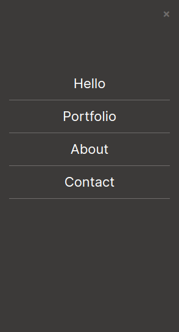

# curriculum-cr-training-mobile-menu

In this project I built a mobile menu of a portifolio, and I have used javascript to make interactions with buttons to work

## Built With

- HTML5 && CSS3
- Javascript (ES6 syntax)

## Getting Started
Since this is an HTML && CSS project, then gettong it and running it is very simple:
clone this repo by typing `git clone https://github.com/arslanbisharat/mobile-menu` after that open the `index.html` file in the browser of your choice, make it in mobile version and click the hmburger icon, see what happens, that's what I did!
## Author

👤 **Arslan Bisharat**

- GitHub: [Arslan Bisharat](https://github.com/arslanbisharat)
- Twitter: [Arslan Bisharat](https://twitter.com/arslanb_isharat)
- LinkedIn: [Arslan Bisharat](https://linkedin.com/in/arslanbisharat)

## Acknowledgments

- Hat tip to anyone whose code was used
- Inspiration
- etc

## 📝 License

This project is [MIT](./MIT.md) licensed.